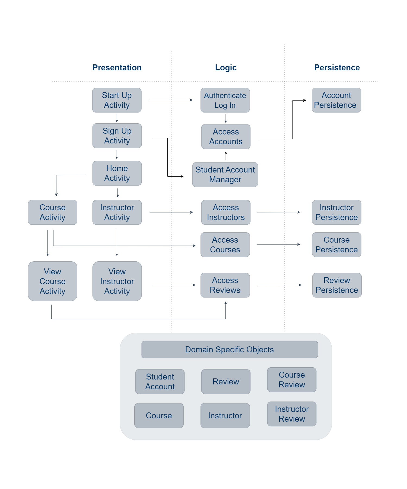

# Iteration 1 Summary

NOTE: We are currently forcing the users to log in before proceeding. In the next iteration, we will allow users to continue as a guest.

## **Progress**

### Completed 

* Account Management 
  * Registration
  * Secure Log-in
  * Secure Log-out
  
* Course and Instructor Discovery
  * Find an instructor 
  * Find a course
  * View a course
  * View an instructor

* Review Management
  * Write a Course Review
  * Write an Instructor Review
  * Edit a Course Review
  * Edit an Instructor Review
  * Delete a Course Review
  * Delete an Instructor Review

NOTE: While we finished these user stories, we plan on polishing more aspects as a part of our objectives for Iteration 2.

### Not Started

* Account Management
  * Personalize Profiles
  * Delete Account
    
NOTE: Due to barriers such as time constraints and complications involving the stubs, we decided to push back these user stories onto Iteration 2. 

## **Architecture Document** 

This is our project's architecture as of the end of Iteration 1.

## **Iteration 2 Objectives** 

* Add proper error catching
* Handle errors and display appropriate user-feedback
* Build an error hierarchy
* Finish the account management feature 
  * Add a user page which allows user to personalize their account
  * Allow users to delete accounts only if they are logged in
* Allow users to continue as guests in our system 
* Polish up our user-interface appearance and functionality 
* Complete a majority of Iteration 2's features 
* Add a proper database and adjusts tests accordingly

