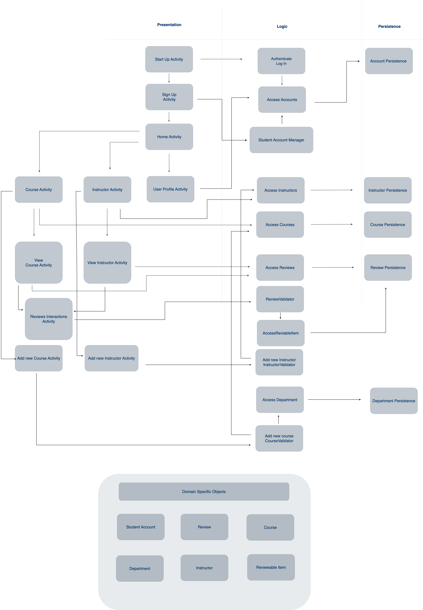

# Iteration 2 Summary

### Completed 

* Content Contribution
    * Adding a New Course
    * Adding a New Instructor
* Review Interaction
    * Disliking an Instructor Review
    * Disliking a Course Review
    * Liking an Instructor Review
    * Liking a Course Review
* Comment Moderation
    * Links in Instructor Reviews
    * Links in Course Reviews
    * Course Review Language
    * Instructor Review Language
* Account Management
    * Personalize Account
    * Delete an Account 

## **Testing Instructions**

### All test (unit & integration)
`AllTests.java`

### Integration test
`IntegrationTests.java`

## **Architecture Document** 

This is our project's architecture as of the end of Iteration 2.

