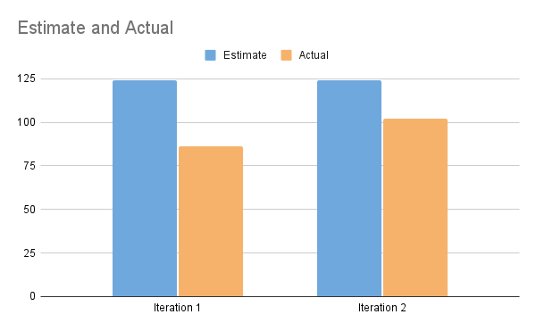

# Retrospective

Although there was a significant improvement in communication and coordination during iteration 2, there were definitely more things we could've done to further enhance our performance. More specifically, we still commited many of the same mistakes we made in iteration 1 -- such as executing the big merge the day before the deadline, not establishing a clear project timeline, and generally starting the work late. 

Our work process for the past two iterations was to plan out and assign the developer tasks, and give the members at least a week to work on their portion alone. We perform our merges and final revisions during the second week -- which didn't give us much room for error, especially when faced with scheduling conflicts and other difficulties. 

### Taking action

To address these concerns in a concrete but realistic manner, the team established the following criteria:

* Create a clear project timeline with set milestones and deadlines.
    - This provides the team a unified understanding of what needs to get done, and gives a sense of responsibility and urgency to get started early

* Adhere to a regular progress update system. While the team already meets consistently every Tuesday and Thursday, team members should provide what they've accomplished, what they're working on, and any blocker they're facing. 
    - This, again, gives a clearer view of the project's overall status and state. 
    - It also gives members with overlapping developer tasks a space to resolve (and possibly prevent) any conflicting functionality.

### Success Criteria 

Our success in adhering to these goals will be measured through the following conditions:

* The frequency and severity of last-minute merges before the deadline
* The difference in set completion date vs. actual completion date 
* The number of bugs found during development -- it should have no significant peak one day before submission
* How well informed the team is about the project's overall status (i.e. what other tasks need to be finished, how much has been done, etc.)

### Results 

WORK IN PROGRESS LOL

## Project Velocity 

